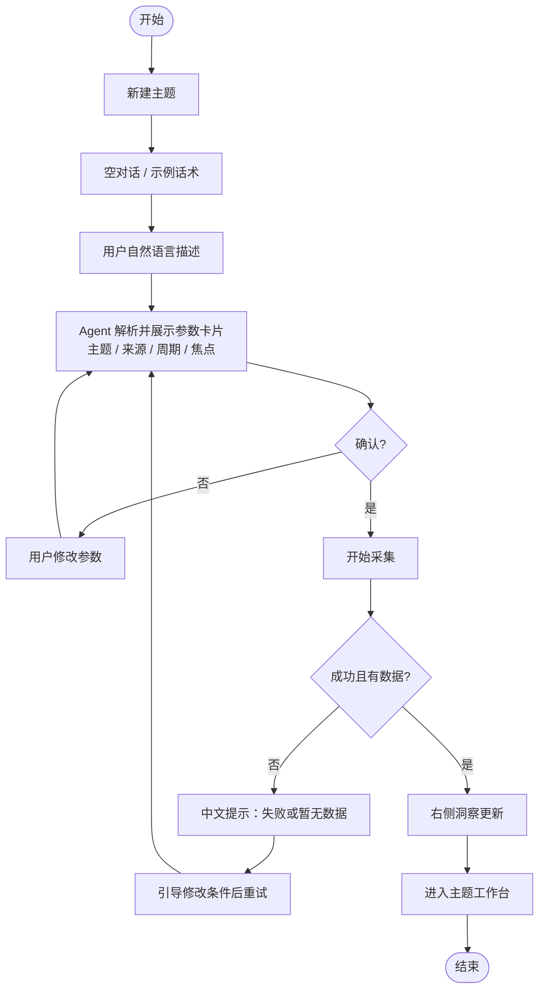
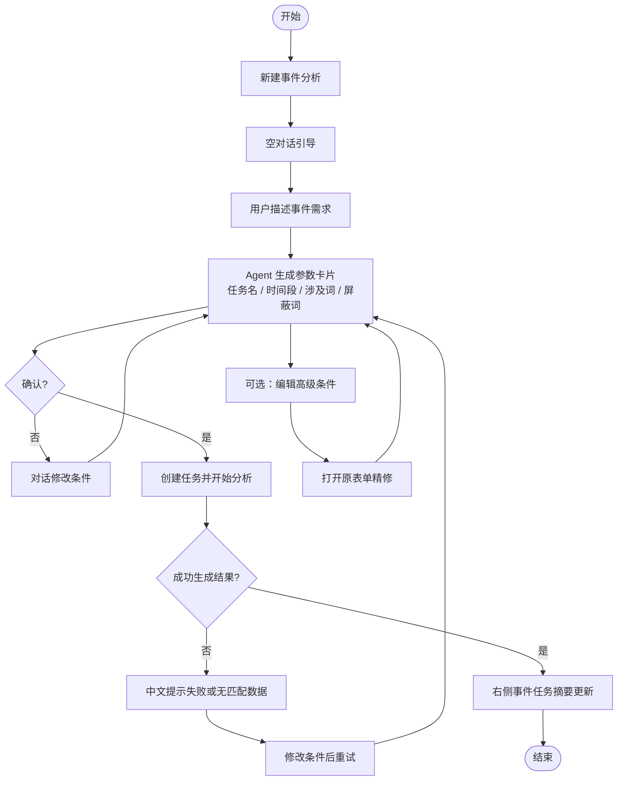
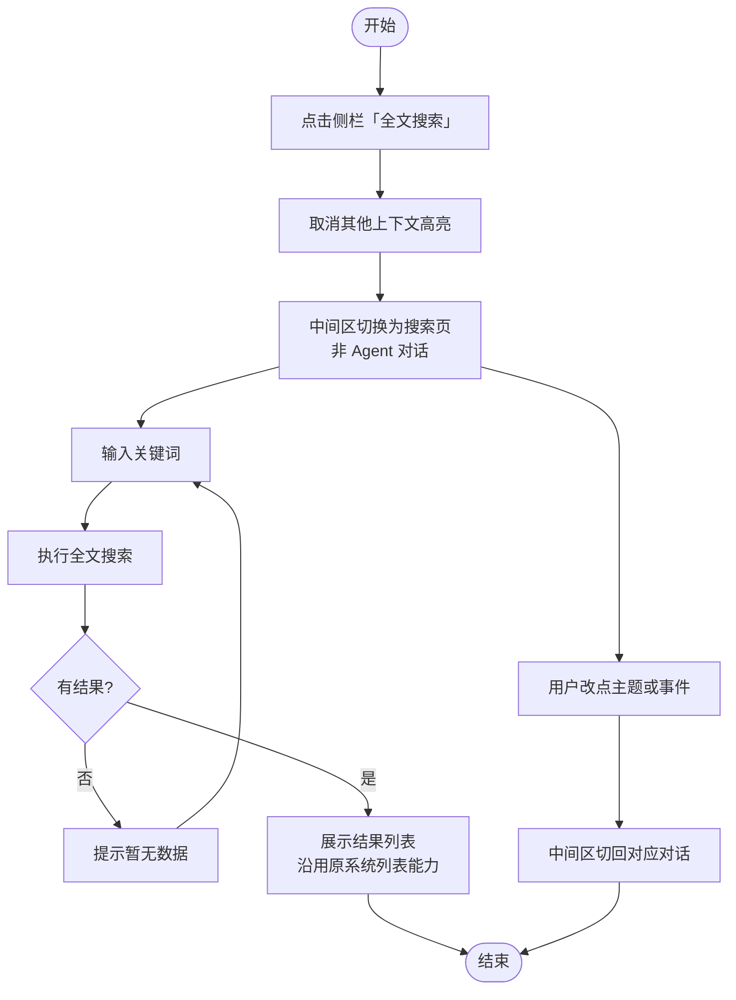
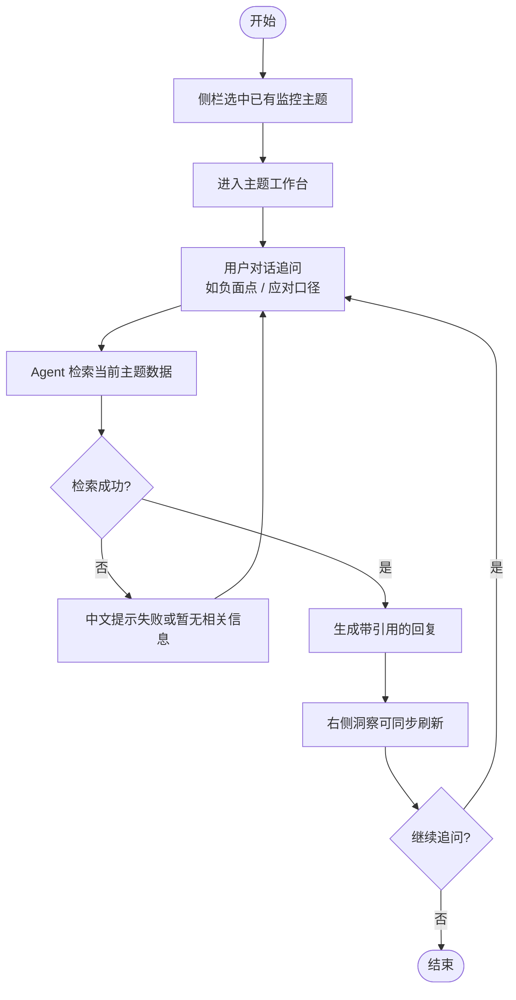

# 第四章 · 交互流程（Mermaid）

可粘贴到：语雀 / Notion / Typora / VS Code Mermaid 预览 / [mermaid.live](https://mermaid.live) 导出 PNG 再插入 Word。

---

## 流程 A · 新建监控主题

---

## 流程 B · 新建事件分析

---

## 流程 C · 全文搜索（模式切换）

---

## 流程 D · 主题内追问研判

---

## 文档前置规则（可放在流程图章节开头）

1. 同一时间仅一个侧栏上下文生效。  
2. 监控主题 / 事件分析 → 中间为 Agent 对话；全文搜索 → 中间为搜索页。  
3. 配置以参数卡片确认为准；事件分析可「编辑高级条件」回退原表单。  
4. 失败与无数据均须中文提示，禁止直接展示后台报错代码。
